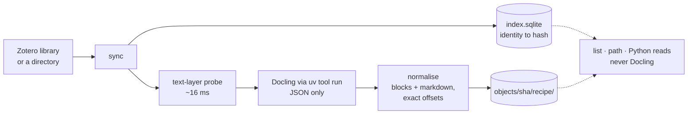

<div align="center">

# pagebound

**Convert each PDF once. Every tool, and every agent, on the machine reads the result.**

[](LICENSE)
[](https://www.python.org)
[](https://pypi.org/project/pagebound/)

[Quickstart](#-quickstart) · [For agents](#-for-agents-and-llm-tools) · [How It Works](#%EF%B8%8F-how-it-works) · [Artifacts](#-artifacts) · [Python API](#-using-it-from-python)

</div>

---

Converting a research PDF into something a machine can reason about is expensive: the Docling model set is one to two gigabytes, and a warm conversion of a fifteen-page paper takes fifteen to thirty seconds. A cost that high, paid repeatedly and independently by every tool on the same machine, is the classic case for a shared cache. **pagebound is that cache**: structured markdown and JSON that carry page and bounding-box provenance for every block, content-addressed, and served to every tool that needs them, and to every agent — the CLI is written so that an LLM agent can find a paper, open its full text and cite a passage by page from `--help` alone.

## 🚀 Quickstart

```bash
uv tool install "pagebound[zotero]"     # the CLI on PATH; [zotero] adds pyzotero for sync
pagebound sync                          # walk the Zotero library, convert what is missing
pagebound sync 10.1016/j.jsis.2016.05.001    # or just one paper, by DOI, key or hash
pagebound list                          # what the cache holds, and each item's state
cat "$(pagebound path 6cbb126970f0)/document.md"    # read a paper by its handle
```

As a dependency instead: `uv add pagebound`, or `uv add "pagebound[zotero]"` for the sync. uv is required either way: Docling is never a dependency, pagebound runs it through `uv tool run`, and the first conversion on a machine downloads it (one to two gigabytes, one-time). Reading a cached paper never runs Docling and works on a machine without it.

## 🧭 Why

Every tool that reads papers ends up solving a slice of the same problem: how to invoke the converter, where to cache the result, how to keep images out of the text, how to carry page and bounding-box provenance, what to do when the converter crashes, how to skip a scan that has no text. pagebound is the union of those slices, written once.

What is actually scarce is not the conversion but the *contract*: a cached artifact that records what produced it, so a consumer can tell whether it still matches the PDF on disk.

| | Cache by filename | pagebound |
|---|---|---|
| Converted once, shared by every tool | varies | ✅ |
| Detects a replaced PDF | ❌ silently stale | ✅ the hash changes, the old handle stops resolving |
| Survives a converter upgrade | ❌ redefines old entries | ✅ a new recipe lands beside the old one |
| Page and bounding-box provenance | varies | ✅ on every block, with exact offsets into the markdown |

Two things pagebound is not. **Not a converter**: [Docling](https://github.com/docling-project/docling) does the conversion, and does it well; pagebound invokes it as an external tool, so the heavy pipeline never enters any consumer's dependency tree. **Not a Zotero plugin**: a Zotero library is one way to find PDFs, a directory is another; both are source adapters.

## 🤖 For agents and LLM tools

The most common reader of a cached paper is not a program but an agent in a conversation: "what does Bandara et al. 2015 say about rigour?", "is this quote really in the paper?", "brief me on this before I read it". pagebound is shaped for that reader.

- 🔑 **A handle you can say.** Every paper has a twelve-character sha256 prefix, such as `6cbb126970f0`. It names the object directory, needs no state beyond the hash, and stops resolving exactly when the PDF behind it is replaced. `pagebound path 6cbb126970f0` prints the directory; `pagebound path BAK9F4R4` (a Zotero item key) and `pagebound path 10.1108/eb024320` (a DOI) do the same.
- 🔎 **Find, then read.** `pagebound list --json` is the whole index as JSON: title, authors, year, DOI, sha256, and whether the text is cached. An agent greps it for a surname and a year, takes the sha256, and reads `document.md` in the directory `pagebound path` prints. Reading never runs Docling, so it costs milliseconds and works on a machine without it.
- 📍 **Cite by page.** `document.json` carries every block with its page and bounding box, and `md_start`/`md_end` offsets into `document.md`, so a passage found in the markdown maps back to "page 4, this box" for a citation or a highlight, with no fuzzy matching.
- 📖 **Help that stands alone.** Every command's `--help` states what it prints, what it needs running, its exit codes (0 found, 1 not in the cache or gave up, 2 usage error) and the fields of any JSON output, so an agent can drive the CLI without reading this file.
- ✔️ **Honest text.** The markdown carries the source characters, never `&amp;` or `\_`, so a verbatim quote check is a string search. Text that came out of OCR is marked as such in `document.json` (`source.text_layer` false), so an agent can weigh it.

A minimal agent skill is three commands:

```bash
pagebound list --json | jq '.[] | select(.authors[] | test("Bandara")) | select(.year == 2015)'
pagebound path <sha256 from above>
cat "$(pagebound path <sha256>)/document.md"
```

## ⚙️ How It Works



1. **Find** - `sync` walks the source and records one index row per item, identity to hash, before any conversion is attempted, so even a paper whose PDF failed to convert is findable.
2. **Probe** - a text-layer check costs about 16 ms. A scan yields nothing without OCR, so it is tombstoned rather than converted; `--ocr-scans` lets Docling OCR it, and the verdict is recorded on the artifact either way.
3. **Convert** - Docling runs as an external tool, JSON output only. Failures are tombstoned per recipe, so a broken PDF is not retried at thirty seconds a run, while a new Docling version retries by itself.
4. **Normalise** - the markdown is generated from the blocks, never through Docling's serializer, so `md_start`/`md_end` are exact by construction and the text carries no escapes. A caption is parented to the table or figure it describes rather than to the body, so it is reached through that item and emitted just before it. The base64 page renders Docling embeds, 97.9% of its JSON, are stripped.
5. **Store** - every artifact is keyed on `(source sha256, conversion recipe)`, where the recipe covers converter, resolved version and options. A Docling upgrade produces a new entry rather than silently changing the meaning of an old one. Reading never asks Docling.

## 📦 Artifacts

Per `(source hash, recipe)`:

| File | For | Mean per paper |
|---|---|---|
| `document.json` | the stable contract; blocks with page, bbox, heading path | 0.17 MB |
| `docling.json` | `DoclingDocument` with page renders stripped, for docling-core consumers | 0.47 MB |
| `document.md` | markdown, with offsets pointing back into the blocks | 0.08 MB |
| `images/` | the paper's figures as PNGs, referenced from `docling.json`, never base64 | 0.4 MB (about 7 figures of 54 KB) |

The shape, with one block from a cached paper:

```json
{ "format_version": 1,
  "source": { "sha256": "6cbb1269…", "pages": 22,
              "page_sizes": [{ "page": 1, "width": 432.0, "height": 648.0 }, "…"],
              "text_layer": true, "probe_pages": 3, "probe_chars": 6202 },
  "conversion": { "converter": "docling", "converter_version": "2.126.0",
                  "options": { "ocr": true, "image_export_mode": "referenced" },
                  "recipe": "6842f033", "converted_at": "2026-09-04T23:17:55+00:00",
                  "pagebound_version": "0.1.0", "duration_seconds": 14.014 },
  "blocks": [
    { "id": 8,
      "kind": "paragraph",
      "text": "directories, encyclopedias, and other reference sources traditionally available in libraries. Soon there really will be something approaching whole libraries accessible by computer.",
      "headings": ["The design of browsing and berrypicking techniques for the online search interface"],
      "layer": "body",
      "page": 2,
      "bbox": [80.0, 554.806, 374.137, 587.8365],
      "md_start": 1508,
      "md_end": 1689 }
  ] }
```

`kind` is one of nine: `heading`, `paragraph`, `list_item`, `table`, `caption`, `footnote`, `formula`, `code`, `image`. `layer` is `body` or `furniture`, Docling's own separation of running headers and footers, kept rather than dropped because filtering is the consumer's policy. `headings` is the section path down to the block. `bbox` is `[l, b, r, t]` in the PDF's own space with the origin at the bottom left, which is also Zotero's convention for annotation rects, so turning a block into a highlight is a field reorder and no geometry. And `document.md[md_start:md_end]` is exactly `text`.

Measured over 113 papers: about 1.1 MB per paper, so a 5,900-paper library costs about 6.5 GB per recipe. Every Docling upgrade is a new recipe and converts again beside the old one, so the cache grows by that much per upgrade until `pagebound clean` drops the superseded conversions; `pagebound stats` shows the cost per recipe at any time.

Two things Docling emits are not stored, and they were most of the bytes. Its JSON carries a base64 render of every page; stripping those removes 97.9% of it and costs nothing, since the result still validates as a `DoclingDocument` and still chunks with `HybridChunker`. And `--image-export-mode referenced` also writes a PNG of every page beside the figures; nothing references them, and on a real library they were 94% of the whole cache, about 12 MB per paper. pagebound versions before 0.1.0 stored them; `pagebound clean` removes them.

Objects are built in a dot-prefixed staging directory and renamed into place, so a reader sees a whole object or none; skip dot-prefixed directories when listing. `document.json` is the completeness sentinel: a directory without it is a tombstone or a torn write, and must not be read. `tombstone.json` is `{"reason": ..., "tombstoned_at": ...}`, the time in ISO 8601 UTC; tombstones written before the field existed have only the reason. When one source has several recipe directories, read the one whose `conversion.converted_at` is newest; `sync` always writes under the recipe that runs now, so that is the current recipe's artifact whenever one exists.

## 🔎 Finding a paper: the index

Artifacts are keyed on `(source sha256, recipe)`, which is file identity, not paper identity. The bridge is `index.sqlite` at the cache root, filled by `pagebound sync`: one row per Zotero item, carrying the item's identity, the PDF's hash and location, and the bibliographic metadata Zotero curates. The row is written before the conversion is attempted, so an item whose PDF failed to convert is still findable by title or DOI, and the store says it is tombstoned rather than the index saying nothing.

<details>
<summary><b>Schema, for non-Python consumers</b></summary>

```sql
items (
    library_key TEXT,  -- 'user' or 'group:<id>'
    item_key    TEXT,  -- Zotero item key
    sha256      TEXT,  -- the artifact key under objects/
    path        TEXT,  -- the PDF on disk
    size        INTEGER,
    mtime       REAL,
    title       TEXT,
    authors     TEXT,  -- JSON array of names, Zotero order
    year        INTEGER,  -- NULL when Zotero has no date
    doi         TEXT   -- lowercase, prefix-stripped; NULL when absent
)
-- PRIMARY KEY (library_key, item_key); indexes on sha256 and doi.

item_collections (
    library_key TEXT,
    item_key    TEXT,
    collection  TEXT   -- Zotero collection name, flat
)
-- PRIMARY KEY (library_key, item_key, collection); index on collection.
-- Rewritten per item on every sync that sees it, so removals in
-- Zotero propagate; like the metadata, a snapshot until the next sync.
```

Open it read-only: the journal mode is WAL, `PRAGMA user_version` is the schema version (currently 1; any other value means delete the file and run `pagebound sync`), and DOIs are stored normalised, so normalise before matching (lowercase, strip `https://doi.org/`, `http://doi.org/`, `https://dx.doi.org/`, `http://dx.doi.org/` and `doi:` prefixes).

</details>

Lookups are exact. Fuzzy search, and metadata for PDFs that never came through a sync, are deliberately out of scope: matching policy belongs to consumers, and the sync is the only writer the index trusts.

## 🐍 Using it from Python

`pagebound.get_document(pdf_path)` returns an `Artifact`: `document`, `markdown`, `path` (the object directory, where `docling.json` and `images/` live) and `converted`, true only when this call ran the converter. It resolves the current recipe, which costs one `docling --version` per process (about 5 s), unless you pass `recipe=Recipe(...)` yourself; an explicit recipe also pins that Docling version on the converter, so the provenance recorded is the Docling that ran. `timeout=` bounds one Docling run in seconds.

`get_cached_document(pdf_path)` returns the newest complete artifact across every recipe, or `None`, and never converts: one hash, no Docling, so it works on a machine without Docling. `cache_status(pdf_path)` reports `cached`, `tombstoned` (with the `Tombstone`'s reason and time) or `absent`, for one recipe or, with `recipe=None`, across all of them, so a batch can say "12 cached, 3 to convert, 1 gave up" before paying for anything.

All three take `fallback_stores=[Store(), ...]`: read-only caches consulted after the writable `store`. A hit there is copied into `store` (about 1 MB per paper), a tombstone there replays, and nothing is ever written to a fallback. A tool that may write only under its own project directory points `store` there and lists the shared cache as a fallback.

Failures are all `PageboundError`. A tombstone replays as `TombstonedError`, a `ConversionFailedError` carrying `reason` and `tombstoned_at`; a tombstoned scan raises `TombstonedNoTextLayerError`, which is also a `NoTextLayerError`, so `except NoTextLayerError` keeps catching scans whether the verdict is fresh or recorded; a PDF that cannot be read raises `SourceUnreadableError`; a missing uv or Docling raises `DoclingUnavailableError`. `force=True` retries a tombstone.

A PDF with no text layer is refused and tombstoned unless `ocr_scans=True` (`--ocr-scans` on the CLI), which lets Docling OCR it under the same recipe and retries an earlier no-text-layer tombstone. Every artifact records the probe's verdict in `document.source`: `text_layer` (false means the text came out of OCR), `probe_pages` and `probe_chars`; older artifacts read them as `None`.

### The `document.md` contract

`document.md` is a contract: it is rendered here from the JSON's raw text, never through Docling's markdown serializer, so it carries no `&amp;`, `\_` or other escapes; every body block with a bounding box and non-empty text is in it verbatim, tables as rendered tables; and each such block's `md_start`/`md_end` are Python string indices into exactly that markdown, with `markdown[md_start:md_end] == block.text`. Running headers and footers (`layer == "furniture"`) are in `document.blocks` but not in the markdown, so their offsets are `None`.

### Resolving by identity

`get_document_for_item(library_key, item_key)` skips hashing when a stat shows the PDF unchanged, and `get_document_for_doi(doi)` reaches an item through the index, preferring the user library when a DOI is held in two; both go through the index, a snapshot of the last sync. The index itself is `pagebound.index.Index` (`lookup`, `lookup_doi`, `lookup_sha`, `lookup_sha_prefix`, `iter_items`), and `pagebound.sync` fills it: `sync_items` takes an iterable of `ZoteroItem` (build them with `iter_items` and a pyzotero client from `zotero_client`, or by hand), so a consumer with its own Zotero access can sync a collection or one item without the CLI. `get_document(path)` on its own writes nothing to the index: the sync is the only writer the index trusts.

A consumer that only reads uses `pagebound.store.Store`: `find_sha_prefix` expands a handle, `artifacts` lists the recipes holding a complete artifact, and `latest_artifact` picks the newest conversion, none of which touches Docling.

### The CLI mirrors this

`pagebound list [--json] [--collection NAME]` shows what the index holds and each item's state, `cached`, `tombstoned` (tried and given up, no artifact) or `absent`; `pagebound path REF` resolves a paper to its object directory. On a terminal, `list`, `stats` and `status` render as tables and coloured lines for people; `--json`, and the paths `path` and `convert` print, are plain text and never change shape in a pipe.

`REF` is read by shape, so one handle works in conversation and on the command line: a sha256 prefix (lowercase hex, six or more characters, git style), a Zotero item key (eight uppercase characters, looked up in the user library), or a DOI. A prefix that matches more than one object is an error, never a guess, and one that names an object written by `pagebound convert` resolves even though that object has no index row. `pagebound path LIBRARY ITEM` still reaches items in group libraries.

```bash
pagebound path 6cbb126970f0          # sha256 prefix
pagebound path MH23L252              # Zotero item key
pagebound path 10.1016/j.jsis.2016.05.001
pagebound path group:12345 ITEM0002
```

`sync` takes the same REFs, and fetches those items from Zotero by key instead of walking anything: `pagebound sync 10.1016/j.jsis.2016.05.001` is how a PDF replaced in Zotero gets picked up without a full pass, and `--force` beside it reconverts a paper whose PDF never changed. A DOI or a sha prefix is looked up in the index, so it names a paper synced at least once; an item key is taken at face value and reaches an item pagebound has never seen. REFs and `--collection` are alternatives, and a REF nothing answers exits 1 without asking Zotero or Docling anything. A Zotero attachment key, the one the storage directory is named after, is refused with the item key it hangs from, since that is the handle everything else here is keyed on.

The twelve-character prefix is the recommended handle: it is what the object directory is named after, it needs no state beyond the hash, and it stops resolving exactly when the PDF behind it is replaced.

`pagebound renormalize` rebuilds the cached documents from the `docling.json` already stored beside them, for a release that changes how Docling's JSON is read. It costs milliseconds a paper, never runs Docling, and keeps each conversion's timestamp and figures; only artifacts whose output actually changes are written, so running it twice is not running it twice. `--dry-run` reports without writing.

`path` reads the cache only, so it needs neither Zotero nor Docling. When a PDF has artifacts under more than one recipe it prints the newest conversion, judged by the artifact's own `converted_at`; since `sync` always writes under the recipe that runs now, that is the current recipe's artifact whenever one exists. A paper that is indexed but has no converted text exits 1 with the tombstone's reason when there is one.

## ⚠️ Notes and limits

- Reading needs neither Zotero nor Docling; converting needs uv, and the first conversion downloads the Docling environment (~1-2 GB, one-time) into the uv cache
- A PDF with no text layer is tombstoned rather than converted, unless OCR is requested; OCR-derived text is always marked as such
- The index is a snapshot of the last sync; lookups are exact, and fuzzy matching is deliberately left to consumers
- You supply the PDFs; there is no retrieval by DOI

## 🧩 Projects using pagebound

- [citefact](https://github.com/hearthresearch/citefact) - audits a manuscript against the full text of its cited sources: citations exist, quotes are verbatim, claims are supported. Reads its source PDFs through this cache, so a manuscript's papers are converted once and every re-run is instant.

Using pagebound in a project? Open a PR to add it here.

## 📄 License

[MIT](LICENSE)

## 🤝 Acknowledgments

- [Docling](https://github.com/docling-project/docling) for PDF conversion
- [uv](https://docs.astral.sh/uv/) for keeping the converter out of everyone's dependency tree

---

*pagebound: convert each PDF once. Built by José Fernandes*
